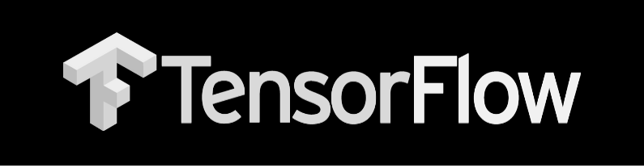
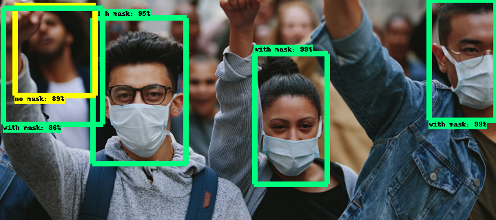

<p align="center">
  
</p>

# Tensorflow-Object-Detection-API-Google_Colab

This is a Custom Object Detection using TensorFlow where in your training in Google Colab. Here I have done a Mask Detection as my contribution for Covid-19. 

You can find the detailed blog about this in this blog. [Link](https://medium.com/@narenltk/tensorflows-object-detection-api-using-google-collab-cb92d7f7b3cf?source=friends_link&sk=08eb1498bcc5bdc08f7d794b87b6d371)

*You can also download the dataset from the link metioned below.*

** [Link](https://github.com/prajnasb/observations) **

## Blog for Reference: [Link](https://medium.com/@narenltk/train-your-own-dataset-for-object-detector-with-tensorflows-object-detector-api-53f74467f6d4)

## Downloading Git repos

Download the full TensorFlow object detection repository located at https://github.com/tensorflow/models by clicking the “Clone or Download” button and downloading the zip file.

Along with this you need to download the Tensorflow Model git repo and faster rcnn model from TensorFlow's model zoo

**Faster-RCNN-Inception-V2 model. [Download the model here.](http://download.tensorflow.org/models/object_detection/faster_rcnn_inception_v2_coco_2018_01_28.tar.gz)**

## Supporting files and models

The Python modules files that supports for this project is as shown below,
  
```
C:\> pip install protobuf
C:\> pip install pillow
C:\> pip install lxml
C:\> pip install matplotlib
C:\> pip install numpy
C:\> pip install scipy
C:\> pip install sklearn
C:\> pip install pandas
C:\> pip install opencv-python
```
## Final output:

<p align="center">
  
</p>
